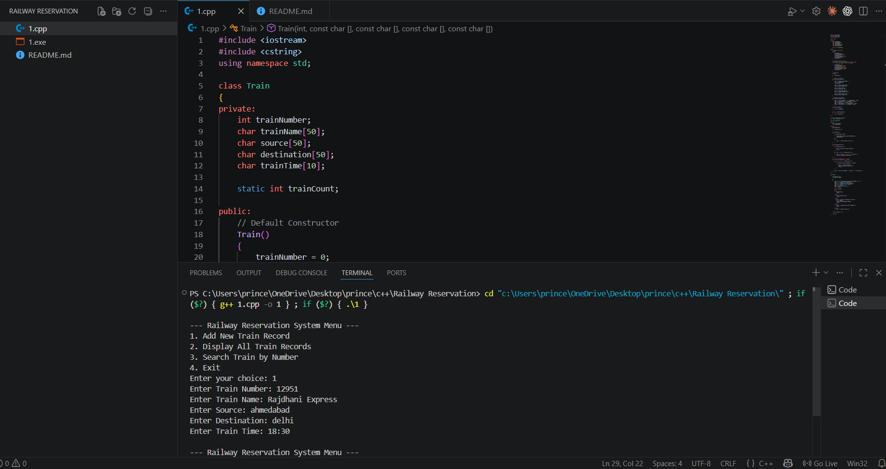

# 🚆 Railway Reservation System

## 📌 Project Description

Railway Reservation System is a simple C++ project developed using Object-Oriented Programming (OOP) concepts.

This project allows users to:

* Add New Train Records
* Display All Train Records
* Search Train By Train Number
* Manage Train Information Efficiently

The project is menu-driven and user-friendly.

---

## ✨ Features

* Add Train Record
* Display All Train Records
* Search Train By Number
* Menu Driven Program
* Object-Oriented Programming (OOP)

---

## 🛠 Technologies Used

* C++
* OOP Concepts
* VS Code
* GCC Compiler

---

## 📂 Project Structure

* Train Class
* Constructors
* Destructor
* Static Data Member
* Search Functionality
* Menu Driven Program

---

## ▶️ How To Run

### Compile the Program

```bash
g++ 1.cpp -o 1
```

### Run the Program

```bash
./1
```

---

## 📷 Screenshot

### Railway Reservation System Output



---

## 🎥 Project Explanation Video

This video contains the complete explanation and working demonstration of the Railway Reservation System project.

▶️ Watch Video:

https://drive.google.com/file/d/1_pcEdjVVcar3rEm4Sko0vWkTOyabJW4k/view?usp=sharing

---

## 📋 Sample Output

```text
--- Railway Reservation System Menu ---

1. Add New Train Record
2. Display All Train Records
3. Search Train by Number
4. Exit

Enter your choice: 1

Enter Train Number: 12951
Enter Train Name: Rajdhani Express
Enter Source: Ahmedabad
Enter Destination: Delhi
Enter Train Time: 18:30
```

---

## 🎯 Concepts Used

* Class and Object
* Constructor
* Destructor
* Static Data Member
* Encapsulation
* Arrays of Objects
* Functions

---

## 🚀 Future Enhancements

* Ticket Booking System
* Passenger Details Management
* Train Schedule Management
* Database Connectivity
* Online Reservation System

---

## 👨‍💻 Author

**Prince**

---

⭐ If you like this project, don't forget to give it a Star on GitHub!

🚆 Thank You For Visiting This Repository.