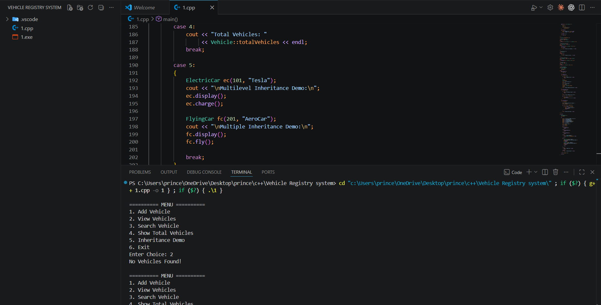

# 🚗 Vehicle Management System

## 📌 Project Description

Vehicle Management System is a simple C++ project developed using Object-Oriented Programming (OOP) concepts.

This project allows users to:

* Add New Vehicle Records
* Display All Vehicle Records
* Search Vehicle By ID
* View Total Number of Vehicles
* Demonstrate Different Types of Inheritance

The project is menu-driven and user-friendly.

---

## ✨ Features

* Add Vehicle Record
* Display All Vehicle Records
* Search Vehicle By ID
* Show Total Vehicles
* Single Inheritance
* Multilevel Inheritance
* Multiple Inheritance
* Menu Driven Program

---

## 🛠 Technologies Used

* C++
* Object-Oriented Programming (OOP)
* VS Code
* GCC Compiler

---

## 📂 Project Structure

* Vehicle Class
* Car Class (Single Inheritance)
* ElectricCar Class (Multilevel Inheritance)
* Aircraft Class
* FlyingCar Class (Multiple Inheritance)
* Vehicle Registry Class
* Static Data Member
* Search Functionality
* Menu Driven Program

---

## ▶️ How To Run

### Compile the Program

```bash
g++ vehicle.cpp -o vehicle
```

### Run the Program

```bash
./vehicle
```

---

## 📷 Screenshot

### Vehicle Management System Output



---

## 🎥 Project Explanation Video

This video contains the complete explanation and working demonstration of the Vehicle Management System project.

▶️ Watch Video:

Paste Your Google Drive / YouTube Video Link Here

---https://drive.google.com/file/d/1yQWj_IUWrfiVsDkijSK76Rdb037_CmAN/view?usp=sharing

## 📋 Sample Output

```text
========== MENU ==========

1. Add Vehicle
2. View Vehicles
3. Search Vehicle
4. Show Total Vehicles
5. Inheritance Demo
6. Exit

Enter Choice: 1

Enter Vehicle ID: 101
Enter Brand: Toyota

Vehicle Added Successfully!
```

---

## 🎯 Concepts Used

* Class and Object
* Constructor
* Static Data Member
* Encapsulation
* Single Inheritance
* Multilevel Inheritance
* Multiple Inheritance
* Arrays of Objects
* Functions

---

## 🚀 Future Enhancements

* Vehicle Service Management
* Vehicle Owner Information
* File Handling
* Database Connectivity
* GUI-Based Application
* Online Vehicle Tracking

---

## 👨‍💻 Author

**Prince**

---

⭐ If you like this project, don't forget to give it a Star on GitHub!

🚗 Thank You For Visiting This Repository.
